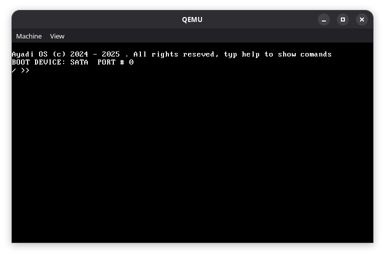

# Corg OS

Ayadi OS kernel
</img>

this kerenel , bleve it or not, my first real project
## Feturs
it have:
- APIC inturupt driver
- APIC Timer
- dynamic memory
- paging
- SATA + ATA disk driver
- pci ...
- fat16 (binded becuse kernel size been more than 256 sectore)
## FAQ
### why?
i want to learn low level, and i think that the best whay to do it is just creat your owne OS, what a winderfule idea! 
after some thinking, i sugest that i have to do some reale work, so i decede to relese as it, 

### Will it stell devolepe ?
i dont think so, if i have a free time, may be i ill chakout it
### How to compile it?
you have to install i386-elf-gcc at /usr/locale/i386elfgcc, 
and then run
``` bash
make iso
make run
```
if you have windows, install wsl, installing the compiler it selfe will be a journy

### wnat to run it on bare metel?
will i do run it, but you have to be carfule, becuse it realy ez to wipe your system with a command; so be carfule.
after compileing , you will get a OS.img, you just have to dd it
``` bash
sudo dd if=OS.img of=*your flash drive* status=progress
```
good luck
